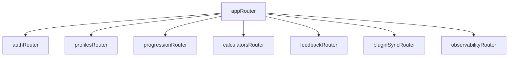

# API Domain Map (tRPC)

The API is organized by domain routers under `apps/api/src/router`.

## Router Topology

## Domain Routers and Responsibilities

## `auth`

- `getSession`: resolve current authenticated user/session.
- `upsertUserFromProvider`: internal post-login sync.
- `createApiKey`: issue plugin key (returns plaintext once).
- `revokeApiKey`: revoke key by id.
- `listApiKeys`: show active/revoked keys metadata.

## `profiles`

- `listProfiles`: list user profiles by game mode.
- `createProfile`: create RSN profile.
- `setPrimaryProfile`: select active profile.
- `deleteProfile`: remove profile and child runs.

## `progression`

- `getRunSnapshot`: typed snapshot for current league run.
- `upsertTaskProgress`: write task progress from web UI.
- `bulkImportProgress`: import/export hydration endpoint.
- `getTaskCatalog`: fetch task definitions for league version.

## `calculators`

- `getCalculatorInputs`: load profile-specific defaults.
- `saveCalculatorInputs`: persist calculator preferences.
- `runDerivedCalcs`: server-side derived computations where useful.

## `feedback`

- `submitFeedback`: create feedback item and optional GitHub issue.
- `listFeedbackStatus`: internal/admin visibility if needed.

## `pluginSync`

- `ingestPluginEvent`: API-key auth, idempotent ingestion path.
- `getPluginDelta`: optional reconciliation endpoint.

## `observability`

- `health`: lightweight liveness/readiness.
- `metrics`: optional scrape endpoint if required by hosting setup.

## Authorization Model

- `publicProcedure`: public/read-only endpoints.
- `authedProcedure`: requires valid user JWT.
- `apiKeyProcedure`: requires valid plugin API key scope.
- `adminProcedure`: optional, for operational endpoints.

## State Ownership Boundary

- Server state lives behind tRPC + React Query.
- Client store is only for local UI state (layout, filters, draft form state).
- Domain writes must go through tRPC mutations, never direct localStorage persistence.

## Legacy Redux Slice Migration Map

- `store/user/account` -> `auth.getSession`, `auth.listApiKeys` via React Query.
- `store/user/character` -> `profiles.*` and `progression.getRunSnapshot`.
- `store/tasks/tasks` -> `progression.getTaskCatalog` and `progression.upsertTaskProgress`.
- `store/unlocks/unlocks` -> `progression` snapshot projection (derived flags, not a separate write model).
- `store/settings/settings` -> small client store (UI preferences) plus server-backed profile defaults where shared cross-device.
- `store/calculators/calculators` -> `calculators.getCalculatorInputs` and `calculators.saveCalculatorInputs`.
- `store/filters` -> client-only UI state (URL/search params + lightweight client store).
