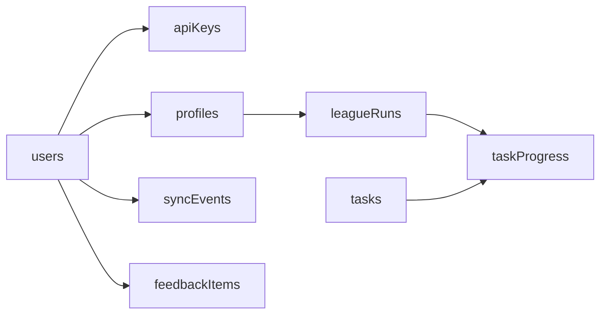

# Data Model V1

This schema is greenfield for `Reldo.net` and intentionally does not preserve legacy DynamoDB shapes.

## Principles

- Normalize entities that are queried often.
- Use append-only event tables for sync/audit.
- Keep client-facing payloads typed and versioned.

## Core Tables

## `users`

- `id` (uuid, pk)
- `auth_provider` (text)
- `auth_provider_user_id` (text, unique)
- `email` (citext, unique)
- `display_name` (text)
- `created_at`, `updated_at` (timestamptz)

## `api_keys`

- `id` (uuid, pk)
- `user_id` (uuid, fk -> users.id)
- `label` (text)
- `key_hash` (text)
- `scopes` (text[])
- `status` (enum: active, revoked)
- `last_used_at` (timestamptz nullable)
- `expires_at` (timestamptz nullable)
- `created_at`, `updated_at` (timestamptz)

## `profiles`

- `id` (uuid, pk)
- `user_id` (uuid, fk -> users.id)
- `game_mode` (enum: leagues, main, ironman, hardcore, ultimate)
- `rsn` (text)
- `is_primary` (boolean)
- `created_at`, `updated_at` (timestamptz)
- unique (`user_id`, `game_mode`, `rsn`)

## `league_runs`

- `id` (uuid, pk)
- `profile_id` (uuid, fk -> profiles.id)
- `league_code` (text) // e.g. `LEAGUE_V`
- `started_at`, `ended_at` (timestamptz nullable)
- `created_at`, `updated_at` (timestamptz)
- unique (`profile_id`, `league_code`)

## `tasks`

- `id` (uuid, pk)
- `league_code` (text)
- `external_task_id` (text) // source id from static task data
- `name` (text)
- `tier` (enum: easy, medium, hard, elite, master)
- `points` (int)
- `metadata` (jsonb)
- unique (`league_code`, `external_task_id`)

## `task_progress`

- `id` (uuid, pk)
- `league_run_id` (uuid, fk -> league_runs.id)
- `task_id` (uuid, fk -> tasks.id)
- `status` (enum: locked, available, complete)
- `completed_at` (timestamptz nullable)
- `source` (enum: manual, import, plugin)
- unique (`league_run_id`, `task_id`)

## `sync_events`

- `id` (uuid, pk)
- `user_id` (uuid, fk -> users.id)
- `profile_id` (uuid, fk -> profiles.id nullable)
- `client_type` (enum: web, plugin)
- `event_type` (text)
- `payload` (jsonb)
- `status` (enum: accepted, rejected)
- `error` (text nullable)
- `received_at` (timestamptz)

## `feedback_items`

- `id` (uuid, pk)
- `user_id` (uuid, fk -> users.id nullable)
- `type` (enum: bug, suggestion, feedback)
- `title` (text)
- `body` (text)
- `github_issue_number` (int nullable)
- `created_at` (timestamptz)

## Relationship View

## Migration Notes

- Legacy `tasks_<rsn>` dynamic keys map to rows in `task_progress`.
- Legacy free-form user blobs become explicit profile and run entities.
- Plugin updates should write `sync_events` first, then update projections (`task_progress`) idempotently.
